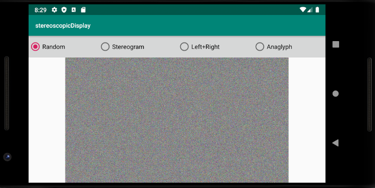
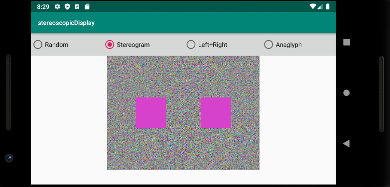
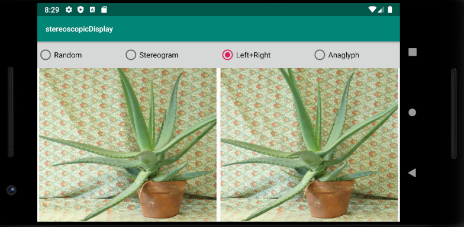
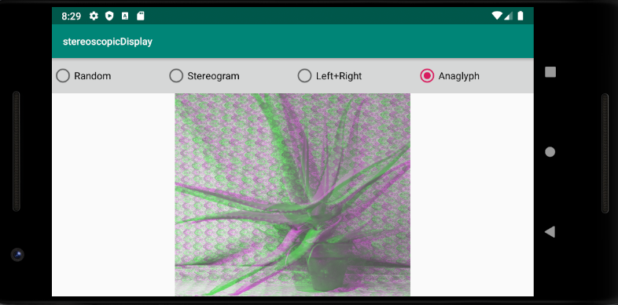

# Android Stereoscopic Display
 A small project showing different image algorithms done in android studio using java.

## Showcase
1920x1080 image containing random "noise" (i.e. each pixel is random) 

Stereoscopic image supposed to create a kind of depth in the noise. Each time this is selected the colours change.

Two of the same image, side by side

The same images, but turned into an anaglyph image by setting luminance of left image to only green channel and right image to only red and blue channel. By doing this, a 3D image is created which can be seen when using the traditional 3D glasses (Red-cyan).

